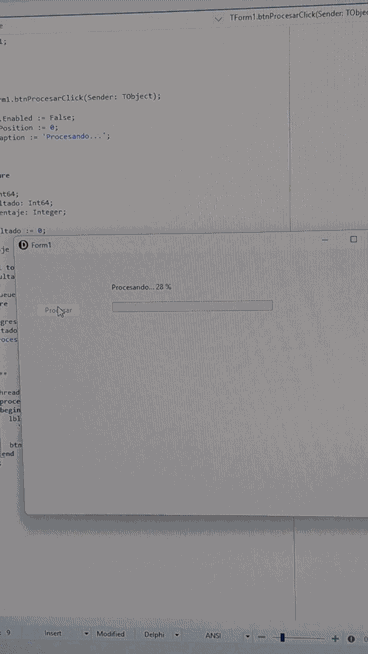

# DelphiTip 01 — TTask y VCL

## Evitar que una aplicación VCL se bloquee durante una tarea pesada

Este ejemplo muestra cómo se ejecuta una operación que requiere tiempo sin bloquear la interfaz de una aplicación desarrollada con Delphi y VCL.

## 🎬 Demostración

  

Durante el procesamiento, la interfaz continúa respondiendo mientras se actualizan el porcentaje y la barra de progreso.

## 🔴 Problema

Cuando una operación costosa se ejecuta directamente desde el hilo principal, la interfaz VCL deja de responder hasta que termina el proceso.

## 🟢 Solución

El ejemplo utiliza:

- `TTask.Run` para ejecutar el trabajo en segundo plano.
- `TThread.Queue` para actualizar de forma segura los componentes VCL.
- `TProgressBar` para visualizar el avance del proceso.
- Una expresión anónima para definir la tarea que se ejecuta en segundo plano.

## ⚙️ Funcionamiento

Al pulsar **Procesar**, se inicia una tarea en segundo plano.

Mientras se realiza el cálculo:

- La ventana continúa respondiendo.
- Se puede mover el formulario.
- Se actualiza la barra de progreso.
- Se muestra el porcentaje procesado.

Al finalizar, se muestra el resultado y se vuelve a habilitar el botón **Procesar**.

## 🧠 Conceptos utilizados

- Programación asíncrona.
- `TTask.Run`.
- `TThread.Queue`.
- Hilo principal de la VCL.
- Expresiones anónimas.
- `TProgressBar`.

## 🛠️ Entorno utilizado

- Delphi 12.1 Community Edition.
- Object Pascal.
- VCL.
- Windows.

## 📚 Serie DelphiTip

Este ejemplo forma parte de **#DelphiTip**, una serie de ejemplos prácticos de Delphi y Object Pascal publicada por **DelphiHeaven & InformatOLI**.

🌐 informatoli.org

---

**DelphiHeaven — Delphi moderno, código práctico.**
